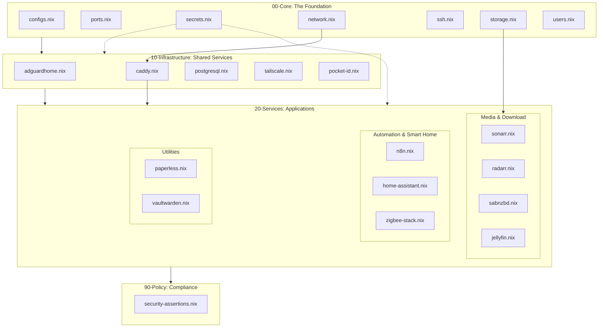

# 🏗️ NixHome System Architecture (NMS v2.3)

### 🛰️ Core Hardware Specs
- **CPU**: Intel i3-9100 (Fujitsu Q958)
- **RAM**: 16GB (Optimized Targets Active)
- **GPU**: UHD 630 (i915 driver, GuC/HuC enabled)
- **Storage**: ABC-Tiering (NVMe / SSD-Pool / HDD-Media)

### 📚 Documentation Reference
- **Master Index**: `/etc/nixos/docs/00_MASTER_INDEX.md`
- **SRE Standards**: `/etc/nixos/docs/09_METADATA_STANDARDS_INTEGRITY.md`
