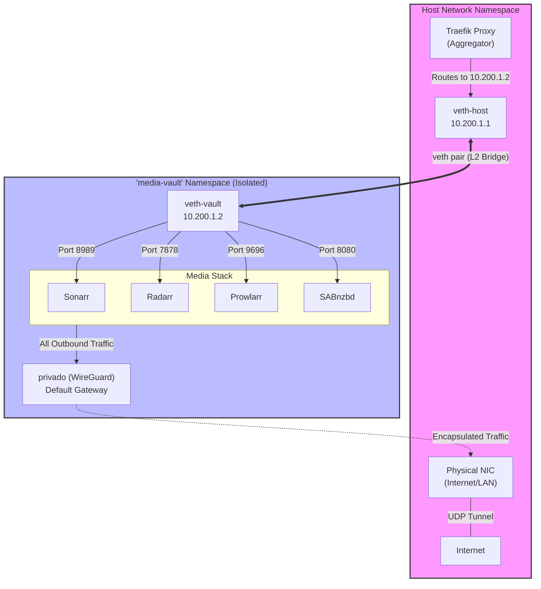

I will search for "media-vault" and "veth" in the `/etc/nixos` directory to understand the network namespace isolation and Traefik bridging configuration.
I'll read `10-infrastructure/vpn-confinement.nix` to extract the specific IP addresses and routing logic for the `media-vault` namespace and then search for references to those IPs in the Traefik configuration.
I'll examine `10-infrastructure/traefik.nix` to confirm how Traefik is configured to route traffic to the `media-vault` namespace via the `veth` bridge.
I'll read `10-infrastructure/traefik-core.nix` and `10-infrastructure/traefik-routes-internal.nix` to find the Traefik routing configuration for services in the `media-vault` namespace.
I'll check `20-services/media/media-stack.nix`, `20-services/media/default.nix`, and the individual service files like `20-services/media/sonarr.nix` to understand how the services in the `media-vault` namespace are exposed to Traefik.

