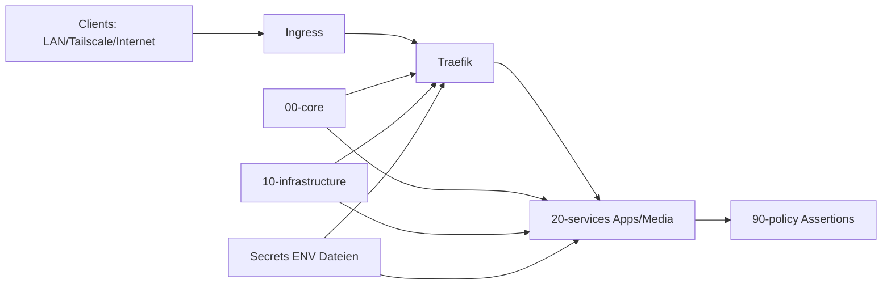

# Meta-Dokument: Entscheidungen, Verwerfungen, Goldnuggets

Stand: 2026-02-24
Zweck: Zentrale Entscheidungsübersicht über aktive Doku (`docs/`) plus historisches Material (`docs/archive/`).

## 1) Quellenbasis (Autorität)
1. Aktiv (maßgeblich für Betrieb):
- `docs/PROJECT_VISION_AND_ARCHITECTURE.md`
- `docs/OPEN_ITEMS_NOW.md`
- `docs/SECRETS_BOOTSTRAP.md`
- `docs/SSH_RECOVERY_POLICY.md`
- `docs/OPERATIONS_GITHUB_PUSH.md`
- `docs/OPERATIONS_RUNBOOK.md`
- `docs/DECISION_LOG.md`
- `docs/NIX_MODULE_CONVENTIONS.md`
- `docs/ARR_API_WIRING.md`

2. Historisch (Ideenspeicher, nicht 1:1 verbindlich):
- `docs/archive/MASTER.md`
- `docs/archive/MASTER (1).md`
- `docs/archive/Claude-NixOS-Masterchat*.md`
- `docs/archive/gemin context.md`

## 2) Architektur- und Betriebsentscheidungen (angenommen)
1. Modularer Aufbau bleibt: `00-core`, `10-infrastructure`, `20-services`, `90-policy`.
2. Guardrail-Ansatz mit Assertions bleibt.
3. Zentrale Port-Registry über `my.ports.*` bleibt.
4. SSH-Notfallpfad bleibt (`PermitTTY`, key-aware Fallback-Logik).
5. Betriebsablauf bleibt: `git pull --ff-only` -> `preflight` -> `nixos-rebuild switch`.
6. Secrets bleiben auf lokaler Runtime-ENV-Datei.
7. Traefik + Cloudflare DNS-Challenge als TLS-Modell bleibt.
8. fail2ban bleibt aktiv.

## 3) Verworfen / bewusst nicht umgesetzt (inkl. Warum)
1. Zusätzliche Secrets-Kryptotooling-Migration in der aktuellen Phase.
Warum verworfen: Fokus auf Stabilität und Betriebsroutine.
2. Breite "alles global öffnen"-Firewallmuster.
Warum verworfen: widerspricht minimaler Angriffsfläche.
3. Komplexe OpenSSH-Match-Negationskonstrukte als Primärschutz.
Warum verworfen: fehleranfällig, potenzielles Lockout-Risiko.
4. Harte Abhängigkeit von Archiv-Texten als direkte Truth-Source.
Warum verworfen: Archive enthalten teils widersprüchliche historische Stände.

## 4) Umgesetzt aus Goldnuggets (2026-02-24)
1. ENV-Secrets-Härtung dokumentiert und standardisiert (`docs/SECRETS_BOOTSTRAP.md`).
2. Archive-Kuration mit Kurz-Headern in `docs/archive/*.md` ergänzt.
3. Preflight vor `switch` standardisiert (`/etc/nixos/scripts/preflight-switch.sh` + Runbook).
4. Architekturdiagramm ergänzt.

## 5) Offene Next Steps
1. Cloudflare/TLS-Operations regelmäßig prüfen (Token-Lifecycle, ACME-Status, Traefik-Health).
2. Preflight-Script bei neuen Services/Abhängigkeiten pflegen.
3. Diagramm bei Strukturänderungen aktualisieren.
