# Network Architecture: Media Vault Confinement (v2.3)

```mermaid
graph TD
    subgraph Host [Host: nixhome.local]
        T[Traefik: 80/443]
        VH[veth-host: 10.200.1.1]
        ING[Secret Ingest Agent]
        SLZ[/etc/nixos/secret-landing-zone/]
    end

    subgraph Vault [Namespace: media-vault]
        VV[veth-vault: 10.200.1.2]
        PRV[WG-Interface: privado]
        
        S[Sonarr: 20989]
        R[Radarr: 20878]
        P[Prowlarr: 20696]
        SAB[SABnzbd: 20080]
    end

    ING -- watches --> SLZ
    T -- Bridge --> VV
    VV -- Internal --> S & R & P & SAB
    S & R & P & SAB -- Default Route --> PRV
    PRV -- Encrypted Tunnel --> Internet((Public Web))
    
    style Vault fill:#1a1b26,stroke:#3d59a1,stroke-width:2px
    style Host fill:#16161e,stroke:#414868
    style PRV fill:#f7768e,stroke-width:2px
```

### Security Assertions
1. **Killswitch:** Ohne `privado` Interface im Namespace ist kein ausgehender Traffic möglich (Default Route dev privado).
2. **Metadata Leak Protection:** DNS-Anfragen der Arr-Dienste werden ausschließlich über den VPN-Tunnel geroutet.
3. **Traefik Isolation:** Traefik kommuniziert nur über die interne VETH-Bridge (`10.200.1.1` <-> `10.200.1.2`) mit den Diensten.
